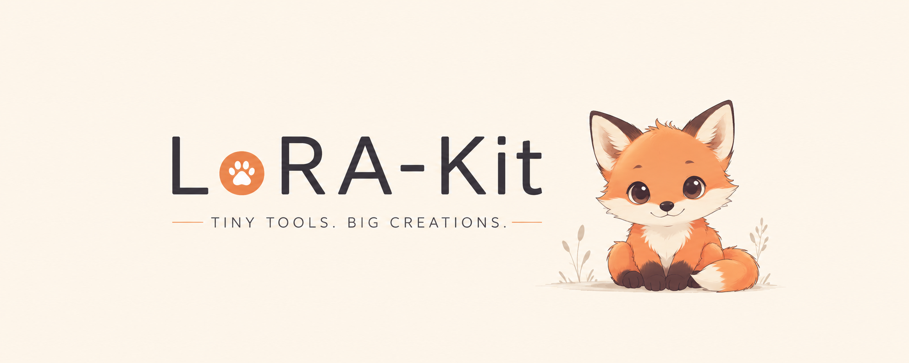

# lorakit

<p align="center">
  
</p>

<p align="center">
  
  <a href="https://github.com/nollafox/LoRA-kit/actions/workflows/test.yml">
    
  </a>
  
  
</p>

<p align="center">
  <a href="#quick-start">Quick Start</a> •
  <a href="#how-lorakit-organizes-things">Data Layout</a> •
  <a href="#the-manifest">Manifest</a> •
  <a href="#commands">Commands</a>
</p>

**lorakit** is a command-line tool for building LoRA training datasets. You import source images, organize them into datasets by copying files into folders, and run one command to prepare and train. Each finished run is archived with the exact inputs that produced it.

The whole project is a directory you can browse with `tree` and edit with a text editor. There is no database, no hidden state, and nothing you can't see. If you've used git, the shape will feel familiar: a pool of available material, named units staged out of it, a build step, and durable artifacts at the end.

## Quick Start

Install lorakit from PyPI:

```bash
$ python -m pip install lorakit
```

That installs the `lorakit` command onto your `PATH`. A typical session imports source images, stages a curated subset, prepares them, and trains:

```bash
$ lorakit init fox-solo
$ cd fox-solo
$ lorakit install --with-models
$ lorakit candidates import 621 fox solo --safe --limit 100
$ lorakit dataset create fox-solo
$ lorakit dataset stage fox-solo --all
$ lorakit dataset prepare fox-solo --size 768 --trigger lorakit
$ lorakit train fox-solo --model sd15
```

The result is `data/artifacts/fox-solo/run-001/model.safetensors`, with a snapshot of the prepared inputs sitting next to it.

The `candidates import 621` step requires [six2one](https://github.com/nollafox/six2one), installable via `python -m pip install six2one`. `xformers` is optional; install `lorakit[accel]` on platforms where you want that acceleration and compatible wheels are available.

For an isolated install, use `pipx install lorakit`. For an editable install from a local clone, run `python -m pip install --user -e .`.

## How lorakit Organizes Things

`lorakit init <folder-name>` creates a project folder with a `lorakit.yaml` file. Commands automatically discover that file by walking upward from the current working directory, so you can run `lorakit dataset list` from the project root or from a nested folder inside it.

Dataset work happens inside `data/`. Base checkpoints default to `~/.lorakit/models`, and Hugging Face downloads cache under `~/.lorakit/models/cache`, so large model files stay shared across projects instead of being copied into every LoRA folder.

```
data/
  candidates/                # The pool of source images + JSON pairs
    IMG_1.[ext]
    IMG_1.json
  staged/
    fox-solo/                # A dataset is a folder of staged images
      IMG_1.[ext]
      IMG_1.json             # Optional per-dataset tag override
  prepared/
    fox-solo/                # Derived from staged; rebuilt on every prepare
      images/
      lorakit-manifest.jsonl
      config.json
  artifacts/
    fox-solo/
      run-001/               # A finished training run
        dataset/             # Immutable snapshot of the prepared inputs
          images/
          lorakit-manifest.jsonl
        model.safetensors
        config.json
lorakit.yaml                 # Project config
```

**`candidates/`** is the pool of source material. Each candidate is an image plus a sibling JSON file with the same stem. Importers like `six2one` write here, and you can drop files in by hand whenever the pair stays matched.

The JSON shape is open-ended. `tags`, `caption`, and `metadata` are the conventional fields:

```json
{
  "tags": ["anthro", "fox", "male", "solo", "blue_eyes"],
  "caption": "An anthropomorphic male fox with blue eyes stands alone.",
  "metadata": {
    "source": "e621",
    "post_id": 6394158,
    "captioning": {
      "draft_caption": "A digital illustration of a lemur-like character standing alone.",
      "caption": "An anthropomorphic male fox with blue eyes stands alone.",
      "caption_backend": "Florence-2-large-PromptGen",
      "editor_backend": "Dolphin3.0-Llama3.1-8B"
    }
  }
}
```

A candidate is **valid** when both its image and JSON sibling exist. Missing one or the other makes it **broken**, which `candidates list` and `clean` will surface for you.

**`staged/<name>/`** is a dataset. Anything in the folder is part of that dataset — that's the whole rule. `lorakit dataset stage` copies files out of `candidates/` so the folder stays hand-editable, and `--symlink` is there if copies are wasteful.

A staged image uses the candidate's metadata by default. To override the tags for a specific dataset, drop a JSON file next to the staged image with the same stem.

**`prepared/<name>/`** is the training-ready build of a dataset. The preprocessed images live under `images/`, alongside a manifest describing them and the config used to build them. It's regenerated from scratch on every prepare or train, so treat it as disposable — never edit by hand, never depend on it across runs.

**`artifacts/<dataset>/run-NNN/`** is the durable record of a finished run. The trained LoRA, the config used, and a copied snapshot of the prepared inputs all sit together. Old runs stay reproducible even when the source dataset changes later, because every run carries its own inputs. Run numbers count up per dataset.

**`lorakit.yaml`** configures the project name, data directory, shared model directory, and Hugging Face cache directory. The default model directory is `~/.lorakit/models`.

## The Manifest

Every prepared dataset comes with a `lorakit-manifest.jsonl`. One image per line, one JSON object per line:

```json
{"image": "images/IMG_1.png", "caption": "lorakit, anthro, fox, male, solo, blue_eyes. lorakit, anthro, fox, male, solo, blue eyes. lorakit. An anthropomorphic male fox with blue eyes stands alone.", "tags": ["anthro", "fox", "male", "solo", "blue_eyes", "blue eyes"]}
```

Each row carries the training prompt plus structured tags. `caption` is the prompt string that training backends actually read. `tags` keeps the structured list so downstream tools can use it without re-parsing. During prepare, underscore tags are kept and expanded with a space-separated companion, so `hi_res` becomes both `hi_res` and `hi res`.

`dataset prepare` controls prompt composition with `--prompt-type`:

| Prompt type | Uses |
| --- | --- |
| `tags` | Raw tags only, such as `iztli, anthro, fox, blue_eyes`. |
| `natural` | Naturalized tags only, such as `iztli, anthro, fox, blue eyes`. |
| `caption` | Top-level candidate `caption`; falls back to naturalized tags if no caption exists. |
| `all` | Raw tags, naturalized tags, then top-level `caption` last. This is the default. |

Different backends adapt cheaply. A Diffusers run, for instance, rewrites each row into `{"file_name": "...", "text": "..."}` on the way in.

The manifest is rebuilt on every `dataset prepare`. The copy inside a finished run's `artifacts/<dataset>/run-NNN/dataset/` is the immutable record of what that run actually saw.

## Commands

### Creating a project

```bash
$ lorakit init fox-solo
$ cd fox-solo
```

`init` creates the folder if needed and writes `lorakit.yaml` at its root. After that, commands discover the project automatically from the current working directory. `--data-dir` still exists for scripts and tests, but normal project work should not need it.

### Importing candidates

```bash
$ lorakit candidates import 621 fox solo --safe --limit 100 [--overwrite]
```

`candidates import` is how source material enters the pool. The first positional argument names the importer, and the rest are passed straight to it. The only importer in this build is `621`, which wraps [six2one](https://github.com/nollafox/six2one) and accepts the same tag query you would type into e621's search bar.

The importer runs in a temporary directory, then its image-and-JSON pairs are copied into `data/candidates/`. Files that already exist with the same stem are skipped silently — pass `--overwrite` to replace them. If `six2one` is not on your `PATH`, lorakit exits with installation guidance.

Candidate stems are global within `data/candidates/`. The `621` importer uses e621 post IDs, which are already unique. Future importers from sources without natural unique IDs should prefix their stems (`local_IMG_0001`, say) to avoid collisions.

### Working with candidates

```bash
$ lorakit candidates list

# Candidates: 240
# Valid:      237
# Broken:     3
#
# NAME            IMAGE                         HAS_JSON
# 000006394158    candidates/000006394158.jpg   yes
# 000006394159    candidates/000006394159.png   yes
```

The summary line counts valid and broken candidates; the table lists them. When nothing is broken, the "Broken" line and broken rows drop out of `text` output, so a healthy pool stays quiet. `--output json` and `--output jsonl` include every row regardless.

```bash
$ lorakit candidates show 000006394158
```

`show` pretty-prints the candidate's JSON to stdout. Handy for grepping, scripting, or piping into another tool.

```bash
$ lorakit candidates caption --preset natural_language [--all] [--limit N] [--quiet]
$ lorakit candidates caption --preset image_tags [--all] [--limit N] [--quiet]
$ lorakit candidates caption --preset natural_language --preset image_tags --all
```

`caption` creates or updates sibling JSON metadata for candidate images. By default it only touches images with no tags at all. `--all` captions every candidate image and merges new output into existing metadata. Use `--limit N` for a small verification pass before captioning a full folder. Captioning shows a progress bar by default; pass `--quiet` to hide it.

`--preset image_tags` uses [`SmilingWolf/wd-vit-tagger-v3`](https://huggingface.co/SmilingWolf/wd-vit-tagger-v3), using its ONNX model and `selected_tags.csv`; this requires `onnxruntime >= 1.17.0`.

`--preset natural_language` uses [`Disty0/Florence-2-large-PromptGen-v2.0`](https://huggingface.co/Disty0/Florence-2-large-PromptGen-v2.0), a Hugging Face Transformers-compatible conversion of [`MiaoshouAI/Florence-2-large-PromptGen-v2.0`](https://huggingface.co/MiaoshouAI/Florence-2-large-PromptGen-v2.0), to draft a visual caption. When existing metadata tags are available, LoRA-kit then uses [`dphn/Dolphin3.0-Llama3.1-8B`](https://huggingface.co/dphn/Dolphin3.0-Llama3.1-8B) as a local caption editor: source tags are treated as trusted, Florence is treated as a draft, and the corrected output is written to top-level `caption` with provenance in `metadata.captioning`. Pass `--preset` more than once to run multiple captioners in one command.

### Datasets

```bash
$ lorakit dataset create fox-solo
$ lorakit dataset stage fox-solo 000006394158
$ lorakit dataset stage fox-solo 000006394159 --symlink
$ lorakit dataset stage fox-solo --all
$ lorakit dataset unstage fox-solo 000006394159
$ lorakit dataset list
$ lorakit dataset status fox-solo
$ lorakit dataset rename fox-solo fox-solo-v2
$ lorakit dataset delete fox-solo-v2 [--yes]
```

`stage` copies an image from `candidates/` into the dataset folder. Pass a candidate stem for one image, or `--all` to stage every valid candidate at once. The image keeps its candidate metadata by default. To override the tags for this dataset, drop a JSON file next to it with the same stem.

`--symlink` substitutes a symlink for the copy. That saves space, at the cost of hand-editability — the linked file still lives back in `candidates/`.

`unstage` removes a single image from the dataset. `delete` removes the entire folder. Neither touches `artifacts/`, so previously trained models stay reproducible even when their source dataset is gone. In an interactive shell, `delete` prompts before deleting; in scripts, pass `--yes`.

`status` prints a summary that includes whether the dataset is currently prepared:

```
Dataset: fox-solo
Staged images:    42
Overrides:        5
Missing metadata: 0
Prepared:         no
Artifacts:        2
```

`Prepared: yes` requires `prepared/<name>/` to exist with both `config.json` and `lorakit-manifest.jsonl` and no broken entries; anything less reads as `no`. `Artifacts` is the number of run directories under `artifacts/<name>/`.

### Preparing a dataset

```bash
$ lorakit dataset prepare fox-solo [options]
```

Preparation clears `prepared/<dataset>/` and rebuilds it from the staged images. The options control how source images are reshaped into training input:

| Option | Default | Description |
| --- | --- | --- |
| `--mode` | `fit` | `copy`, `fit`, `center-crop`, or `pad`. |
| `--size N` | `512` | Shortcut for `--width N --height N`. Cannot be combined with `--width`/`--height`. |
| `--width W` / `--height H` | from `--size` | Explicit target box. |
| `--image-format` | `original` | `png`, `jpg`, `webp`, or `original`. |
| `--trigger` | `""` | Trigger word prepended to the prepared prompt. |
| `--prompt-type` | `all` | `tags`, `natural`, `caption`, or `all`. |
| `--remove-watermarks` / `--no-remove-watermarks` | enabled | Remove text-like overlays before resizing. |

The four modes differ in how they handle aspect ratio:

- `copy` does nothing. Images are copied unchanged; any explicit dimension flag is an error.
- `fit` resizes to fit inside the target box, preserving aspect ratio.
- `center-crop` crops to the target aspect ratio and then resizes to the target box.
- `pad` resizes to fit, then pads the remainder to fill the box.

If you supply only one of `--width` or `--height`, `fit` constrains that one dimension; `center-crop` and `pad` mirror it for the missing one; `copy` errors.

`--image-format original` passes the source format through. `png`, `jpg`, and `webp` convert. Converting a transparent source to `jpg` errors rather than silently flattening — handle transparency at the source, or use a format that supports it.

Watermark removal uses the EasyOCR detector installed by `lorakit install --with-models`, then repairs selected regions with OpenCV inpainting. `dataset prepare` does not download detector weights itself; if the models are missing, it fails with instructions instead of reaching out mid-run. Pass `--no-remove-watermarks` when you want the source pixels copied or resized exactly as-is.

### Models

The `models` group manages the base checkpoints you train on top of.

```bash
$ lorakit install --with-models
```

`install --with-models` warms LoRA-kit’s configured caches without mirroring whole Hugging Face repos into `models/`. Hugging Face assets are initialized in `~/.lorakit/models/cache` by default, while EasyOCR detector files live under the configured model directory. Run it once per configured cache, then normal commands reuse those files.

```bash
$ lorakit models list

# NAME        TYPE        FORMAT       PATH
# sd15        checkpoint  safetensors  models/sd15.safetensors
# pony-v6     checkpoint  safetensors  models/pony-v6.safetensors
# sdxl-base   diffusers   directory    models/sdxl-base
```

Two formats are discovered automatically under `models/`:

- Single checkpoint files: `*.safetensors`, `*.ckpt`, `*.pt`.
- Diffusers model directories: any folder containing `model_index.json`.

```bash
$ lorakit models search sdxl [--task text-to-image] [--limit 20]
$ lorakit models fetch stable-diffusion-v1-5/stable-diffusion-v1-5 [--name sd15]
$ lorakit models remove pony-v6 [--yes]
```

`search` queries Hugging Face via `huggingface_hub.HfApi.list_models()` and respects its filters.

`fetch` looks inside a Hugging Face repository for `.safetensors` files and downloads a single selected checkpoint into the configured model directory. If there is exactly one `.safetensors` file, LoRA-kit downloads it. If there are several, LoRA-kit prompts interactively so you can choose the right one. `--name` renames the local checkpoint. Private or gated repos use the standard `HF_TOKEN` environment variable or a prior `hf auth login`.

`remove` resolves the local name using the same rules as the `--model` flag — `models/<name>/`, then `models/<name>.*` — and refuses to act on an ambiguous match.

You can also download checkpoints directly with the Hugging Face CLI. See [`models/README.md`](models/README.md) for a concrete `hf download` example.

### Training

```bash
$ lorakit train fox-solo --model sd15
```

That is the common case: train the staged dataset `fox-solo` against the base model `sd15`, using sensible defaults for everything else. Every default is exposed as a flag for when you need them:

```bash
$ lorakit train fox-solo \
    --model sd15 \
    --preset character \
    --backend diffusers \
    --resolution 512 \
    --rank 16 \
    --steps 2000 \
    --learning-rate 1e-4 \
    --batch-size 1 \
    --gradient-accumulation 4 \
    --mixed-precision fp16
```

`--preset` fills in the training knobs for common LoRA goals. Presets are just defaults: pass `--rank`, `--steps`, `--learning-rate`, `--batch-size`, or `--gradient-accumulation` to override any individual value.

| Preset | Use case | Rank | Steps | Learning rate |
| --- | --- | ---: | ---: | ---: |
| `concept` | Simple visual concepts: ears, markings, props, small objects, simple accessories. | 8 | 1200 | `1e-4` |
| `clothing` | A specific garment or wearable item. | 16 | 2000 | `1e-4` |
| `character` | Balanced character identity training. | 16 | 2200 | `1e-4` |
| `style` | An artist, style, or aesthetic LoRA. | 32 | 2500 | `5e-5` |
| `clothing-simple` | Hats, collars, simple shirts, glasses, simple jackets. | 8 | 1500 | `1e-4` |
| `clothing-detailed` | Complex outfits, armor, uniforms, accessories, patterned garments. | 32 | 2800 | `5e-5` |
| `character-lite` | Flexible character LoRAs that should not overfit too hard. | 8 | 1600 | `1e-4` |
| `character-detail` | Detailed character identity, markings, outfit, and body features. | 16 | 2600 | `1e-4` |
| `style-soft` | Promptable style influence that should not overpower images. | 16 | 2000 | `5e-5` |
| `style-strong` | More faithful style capture. | 32 | 3000 | `5e-5` |

All presets use `--batch-size 1` and `--gradient-accumulation 4`.

`train` always runs `dataset prepare` first, so a single command goes from staged folder to trained LoRA. Any prepare flags you pass to `train` flow through to that step. Pass `--no-prepare` to skip preparation and reuse whatever is already in `prepared/<dataset>/`.

Either way, the prepared dataset is copied into `artifacts/<dataset>/run-NNN/dataset/` so the run stays reconstructable.

`--dry-run` resolves the model, prints the effective prepare and train configs, and exits — without touching files or launching training. It also reports whether prepare would have run.

`--run-name` overrides the default `run-NNN` directory name.

`--model` resolves in this order:

1. A path that exists on disk.
2. `models/<name>/` as a Diffusers directory.
3. `models/<name>.*` as a checkpoint file.
4. Otherwise, a Hugging Face repo ID.

The resolved path is recorded in the run's `config.json` so future audits know which model was used.

On success, the run lands at `data/artifacts/<dataset>/run-NNN/`, where NNN is one greater than the largest existing run for that dataset. The trainer's output file is normalized to `model.safetensors`.

The Diffusers backend tries to enable `xformers` memory-efficient attention when it is installed. If it is missing, training falls back to PyTorch attention. Install the optional accelerator extra only on platforms where `xformers` is supported:

```bash
$ python -m pip install 'lorakit[accel]'
```

### Cleaning data

```bash
$ lorakit clean [--apply]
```

`clean` scans `candidates/` and `staged/` for orphans — files whose siblings are missing — and proposes deletions. Run it with no flags to preview, or `--apply` to perform the deletes.

The rules:

- In `candidates/`, an image without a JSON sibling, or a JSON without an image sibling, is an orphan.
- In `staged/<dataset>/`, a staged image is an orphan when it has no candidate JSON and no staged override.
- A staged JSON is an orphan when there's no matching staged image.

Orphans never block other commands. They simply surface as broken in `candidates list` and as missing metadata in `dataset status`.

## Global Options

Two flags apply across the CLI:

| Flag | Where | Description |
| --- | --- | --- |
| `--data-dir <path>` | Every command. | Overrides project discovery and uses an explicit data directory. Mostly useful for tests and scripts. |
| `--output text\|json\|jsonl` | Commands that print structured results. | Defaults to `text`. You can put it before the command or on the command itself. Destructive commands ignore it. |

Most project work starts with `lorakit init <folder-name>`, which writes `lorakit.yaml`. After that, commands discover the project automatically by walking upward from the current directory.

## Command Reference

```
lorakit init <folder-name>
lorakit install [--with-models]
lorakit candidates import 621 ... [--overwrite]
lorakit candidates list
lorakit candidates show <stem>
lorakit candidates caption --preset <natural_language|image_tags> [--preset ...] [--all] [--limit N] [--quiet]
lorakit clean [--apply]
lorakit dataset create <name>
lorakit dataset delete <name> [--yes]
lorakit dataset rename <old> <new>
lorakit dataset list
lorakit dataset status <name>
lorakit dataset stage <dataset> <image> [--symlink]
lorakit dataset stage <dataset> --all [--symlink]
lorakit dataset unstage <dataset> <image>
lorakit dataset prepare <dataset> [options]
lorakit models list
lorakit models search <query>
lorakit models fetch <repo_id> [--name NAME]
lorakit models remove <name> [--yes]
lorakit train <dataset> [options]
```

## Development

Install with Poetry:

```bash
$ poetry install
```

Run the CLI and the test suite from inside the Poetry environment:

```bash
$ poetry run lorakit --help
$ poetry run lorakit dataset list
$ poetry run pytest
$ poetry run python -m compileall -q src
```

The CLI is a thin layer over a standalone core. You can import the domain modules — `candidates`, `datasets`, `prepare`, `models`, `training`, `clean` — and call them directly. A `Project` facade at `lorakit.Project` wraps them in the same grouped namespace the CLI uses:

```python
from lorakit import Project, PrepareConfig, TrainingSpec

p = Project("./data")
p.candidates.import_from("621", ["fox", "solo", "--safe", "--limit", "100"])
p.datasets.create("fox-solo")
p.datasets.stage_all("fox-solo")
p.datasets.prepare("fox-solo", PrepareConfig(mode="center-crop", width=768))
p.train(TrainingSpec(dataset="fox-solo", model="sd15"))
```

A future HTTP API or UI calls the same surface.

<br>

***

<p align="center">
  <strong>lorakit</strong> — git-style project management for LoRA training.
</p>

<p align="center">
  Crafted by <strong>Nolla Fox</strong>
</p>
